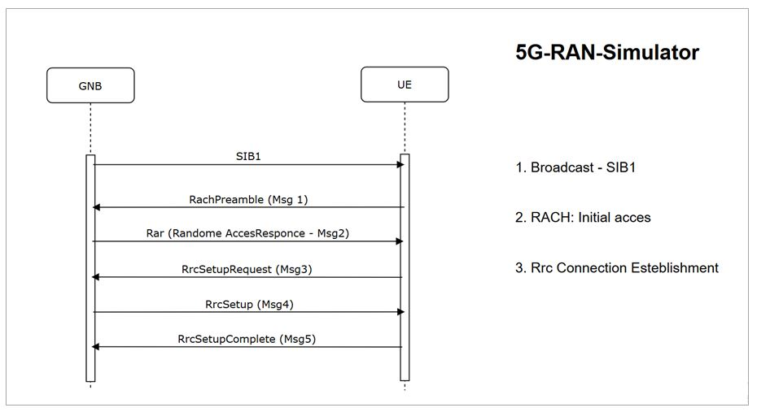

# 5G RAN Simulator

This project is a high-level 5G RAN network simulator designed to demonstrate C++ system programming skills and an understanding of telecommunications protocol architecture.

Technology stack
C++: gNB and UE core logic

## Basic components

* **gNB (Next Generation NodeB):** Manages Radio Resource Control (RRC)
* **RadioHub:** Acts as a transparent proxy between gNB and UE. RadioHub simulates the transmission of messages over radio.
* **UE (User Equipment):** Simulates the mobile device's protocol stack and state transitions.

##  Protocol Sequence (Initial Access & Registration)

The following diagram illustrates the implemented signaling flow, from Cell Selection to successful Network Registration:

