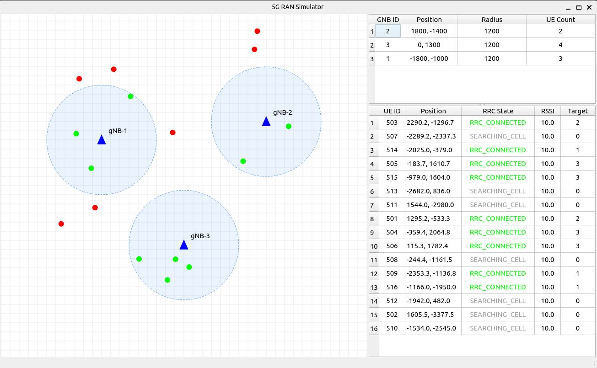

# 5G RAN Simulator

This project is a high-level 5G RAN network simulator designed to demonstrate C++ system programming skills and an understanding of telecommunications protocol architecture.

Technology stack
C++: gNB and UE core logic

## Basic components

* **gNB (Next Generation NodeB):** Manages Radio Resource Control (RRC)
* **RadioHub:** Acts as a transparent proxy between gNB and UE. RadioHub simulates the transmission of messages over radio.
* **UE (User Equipment):** Simulates the mobile device's protocol stack and state transitions.

##  Protocol Sequence (Initial Access & Registration)

The following diagram illustrates the implemented signaling flow, from Cell Selection to successful Network Registration:

## USER VIEW

This allows the user to see base stations (GNBs) with their coverage radius on the map, as well as user equipments (UEs) connected to specific GNB and UEs not connected to any GNB. Tables with additional information are also available to the right of the map.

## Deployment Modes

The simulator now supports two distinct deployment modes, configured via the `config.yaml` file under the `simulation` section:

simulation:
  is_monolithic: false

1. Monolithic Mode (is_monolithic: true)
How it works: The SimulationController automatically spins up and manages all network nodes (GnbLogic and UeLogic) internally as local objects within the same process.

Use case: Ideal for quick local testing, debugging core simulation logic, and lightweight scenarios without network orchestration overhead.

2. Distributed Mode (is_mololithic: false)
How it works: Nodes are deployed independently as separate, standalone services.

Use case: Designed for realistic telecom network emulation, scalability testing, and simulating real-world distributed environments.
